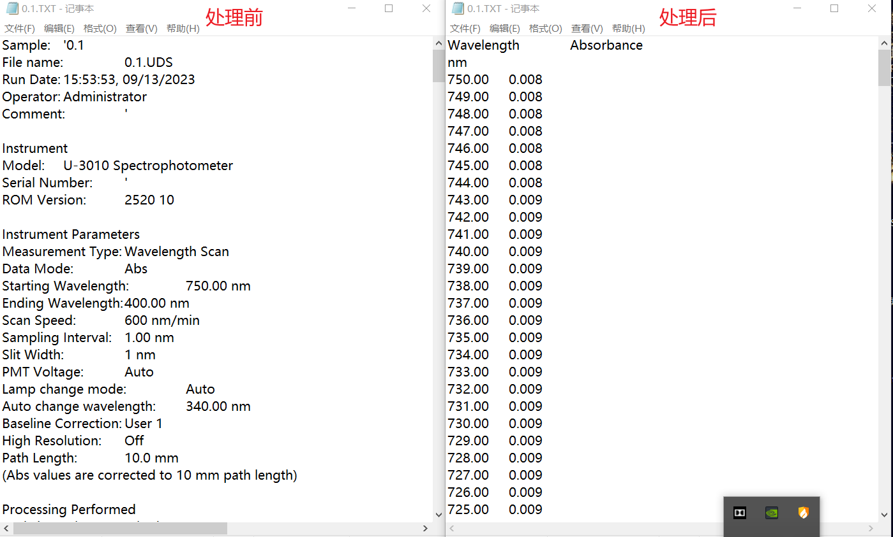
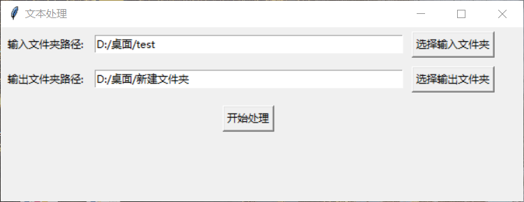
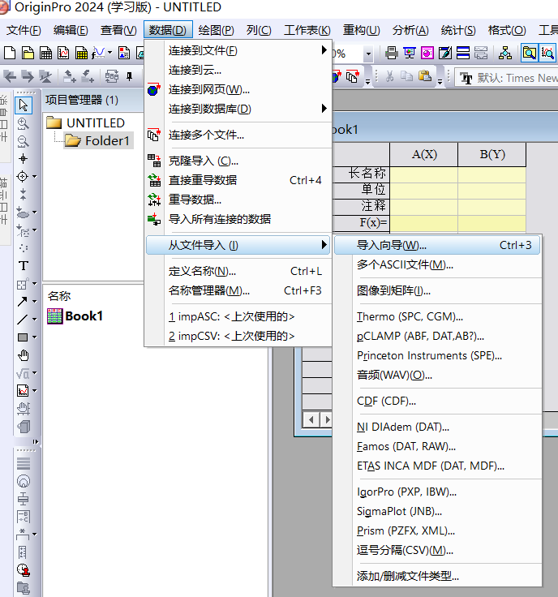

# Absorption-data-processing

用途：处理吸收数据

效果：批量去除数据上方的大量文字并添加合适的长名称与单位，便于一键导入处理绘图

## 使用方法

### 1、右侧release下载main.exe和origin\_filter.oif

### 2、点击main.exe，依次选择输入文件夹与输出文件夹后，点击开始处理

### 3、处理完成后打开origin软件，选择数据-从文件导入-导入向导，批量选择输出文件夹内的文件后选择过滤器完成导入

